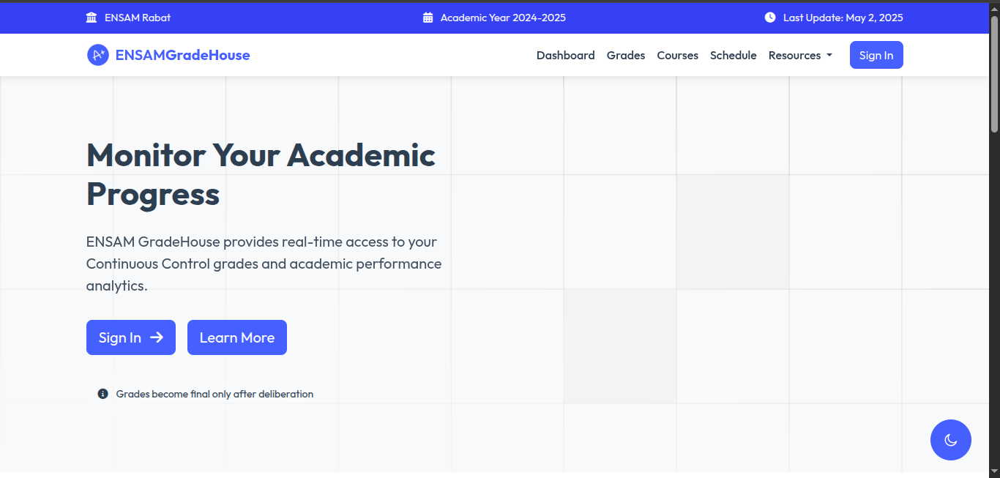
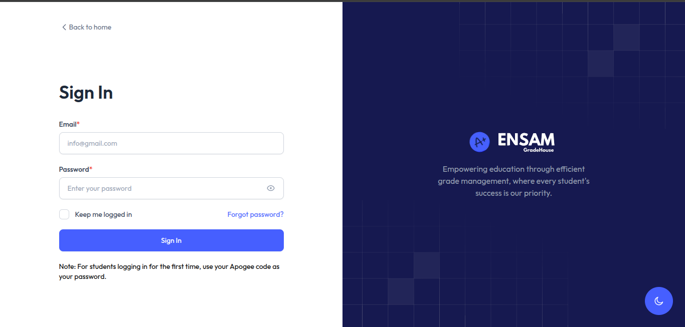

# Overview
**ENSAM GradeHouse** is a Laravel-based web application designed to streamline continuous assessment grade management at **École Nationale Supérieure d'Arts et Métiers de Rabat (ENSAM Rabat)**. The platform provides instructors with tools to input grades and students with real-time access to their academic progress.

### Screenshots



---

## 🚀 Key Features

### For Instructors
- Grade management dashboard
- Bulk import/export via CSV
- Grade analytics and statistics
- Automated email notifications

### For Students
- Personalized grade portal
- Progress visualization
- Instant grade publication alerts

### System Features
- Role-based access control (Admin/Teacher/Student)
- Comprehensive admin panel
- Data export capabilities

---

## 🧱 Technology Stack

### Backend
- **Framework:** Laravel 10
- **PHP Version:** 8.2+
- **Database:** MySQL
- **Authentication:** Laravel Breeze
- **Testing:** PestPHP

### Frontend
- **Styling:** TailwindCSS
- **Interactivity:** Alpine.js
- **Templating:** Blade

---

## 🛠️ Installation Guide

### Prerequisites
- PHP 8.2+
- Composer
- Node.js
- MySQL

### Setup Instructions

1. **Clone the repository**
```shell
git clone https://github.com/issamiaymane/ensam-gradehouse.git
cd ensam-gradehouse
```
2. **Install dependencies**
```shell
composer install
npm install
```
3. **Configure environment**
```shell
cp .env.example .env
php artisan key:generate
```
4. **Database setup**
Update .env with your database credentials
Run migrations:
```shell
php artisan migrate --seed
```
5. **Start the development server**
```shell
php artisan serve
```
###🖥️ Production Deployment (Apache)
Move project to web directory:

```shell
sudo mv /path/to/laravel /var/www/laravel
sudo chown -R www-data:www-data /var/www/laravel
sudo chmod -R 755 /var/www/laravel
```

Create Apache configuration (/etc/apache2/sites-available/laravel.conf):
```shell
apache
<VirtualHost *:80>
    ServerAdmin webmaster@localhost
    DocumentRoot /var/www/laravel/public
    ServerName your_domain_or_IP

    <Directory /var/www/laravel/public>
        Options Indexes FollowSymLinks
        AllowOverride All
        Require all granted
    </Directory>

    ErrorLog ${APACHE_LOG_DIR}/laravel_error.log
    CustomLog ${APACHE_LOG_DIR}/laravel_access.log combined
</VirtualHost>
```
Enable the site:
```shell
sudo a2ensite laravel.conf
sudo a2enmod rewrite
sudo a2dissite 000-default.conf
sudo systemctl reload apache2
```
---
## 👨‍💻 Contributor
[Aymane ISSAMI](https://github.com/issamiaymane)

---

## 📜 License

This project is protected under a custom license.  
You are **not permitted** to:

- Copy or redistribute any part of this code
- Modify or create derivative works
- Use this project in commercial or non-commercial applications

**Usage, modification, or redistribution of this project requires prior written consent from the author.**

---

Built with ❤️ for ENSAM Rabat
---
